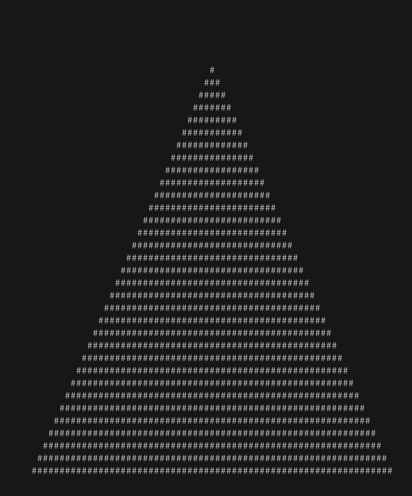

# Yet Another Pokey Rendering Engine (in Rust This Time)

I think this is the 5th time (?) that I have started working on a ray-tracing
rendering engine. Hopefully this time with more follow through as Rust makes
things easier to get setup and running with fewer errors along the way.

The project is in the very early stages right now and there really isn't much
of anything substantial. The biggest milestone hit so far has been being able
to render a triangle in '#' characters by calculating collisions between rays
and a triangle. Here is that image:

And now it can render animations:

